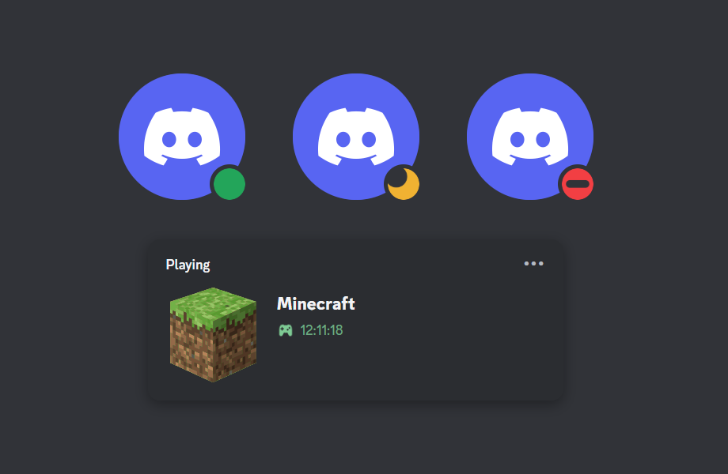

<div id="Phantom" align="center">
    <h1>Online Forever</h1>
    <p>Keep your Discord account 24/7 online.</p>
    
</div>

---

<p align="center">
<b>⭐ If this project helped you, consider starring the repository!</b>
</p>

> [!IMPORTANT]
> **Disclaimer — Read Before Using**
> This project automates a **user account**, which violates [Discord's Terms of Service](https://discord.com/terms) and [Community Guidelines](https://discord.com/guidelines). Accounts found automating user connections may be **suspended or permanently terminated**.
>
> - I am **not responsible** for any consequences resulting from the use of this code.
> - Use this software **at your own risk**.
> - This repository is **not affiliated with, authorized, maintained, sponsored, or endorsed by Discord Inc.** or any of its affiliates or subsidiaries.

> [!WARNING]
> **NEVER share your Discord token with anyone.**
> A token grants **full access** to your account without any password or 2FA. Anyone with your token can log in as you, read your DMs, and change your account settings.

---

## ✨ Features

- Runs locally your token never leaves your machine
- Supports custom status (with optional emoji)
- Keeps your account online 24/7
- Supports all status modes: `online`, `idle`, `dnd`, `invisible`
- Cross-platform, works anywhere Python 3.8+ runs
- Simple JSON config, no code editing required

---

## Obtaining Your Token

> [!CAUTION]
> A user token is equivalent to your password. Treat it like one.

1. Log in to Discord in your **browser** (not the desktop app).
2. Press <kbd>Ctrl</kbd> + <kbd>Shift</kbd> + <kbd>I</kbd> (or <kbd>F12</kbd>) to open DevTools.
3. Go to the **Network** tab and keep it open.
4. Refresh the page.
5. In the filter box, type `api/v9` or `api/v10`.
6. Click any request to `discord.com/api/...` — ideally the one named `messages` or `science`.
7. Open the **Headers** sub-tab and scroll to **Request Headers**.
8. Copy the value next to `authorization:`. That's your token.

> [!WARNING]
> **Do not paste your token into any website, bot, or Discord message** even if it claims to "check" or "verify" it. That is always a scam.

---

## 🛠️ Installation

### 1. Install Python
Download Python **3.8 or newer** from [python.org/downloads](https://python.org/downloads).

> On Windows, tick **"Add Python to PATH"** during installation


Verify with:
```bash
python --version
```

### 2. Download the project
Either clone the repo:

```bash
git clone https://github.com/SealedSaucer/Online-Forever.git
cd Online-Forever
```
Or download the ZIP and extract it.

3. Configure
Open config.json and edit:

```json
{
  "token": "YOUR_TOKEN_HERE",
  "status": "online",
  "activity": {
    "type": "playing",
    "name": "Minecraft"
  }
}
```

See the Configuration section below for all options.

4. Install dependencies

```bash
pip install -r requirements.txt
```
5. Run it
```bash
python main.py
```
